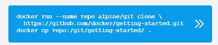

# Docker steps 

## First, clone a repository
---

The Getting Started project is a simple GitHub repository which contains everything you need to build an image and run it as a container.

## Now, build the image
---

A Docker image is a private file system just for your container. It provides all the files and code your container needs.

## Run your first container
---

Start a container based on the image you built in the previous step. Running a container launches your application with private resources, securely isolated from the rest of your machine.

## Now save and share your image
---

Save and share your image on Docker Hub to enable other users to easily download and run the image on any destination machine.