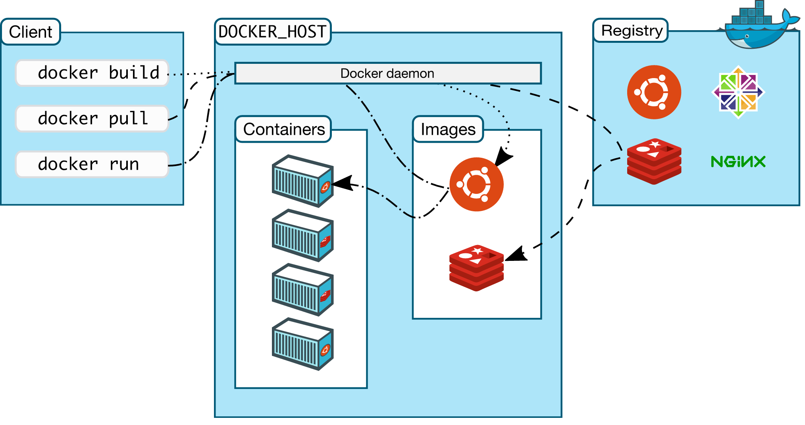

# Docker
---

- Docker home page - https://www.docker.com/

## What is Docker?
---
Docker is an open platform for developing, shipping, and running applications. Docker enables you to separate your applications from your infrastructure so you can deliver software quickly. With Docker, you can manage your infrastructure in the same ways you manage your applications. By taking advantage of Docker’s methodologies for shipping, testing, and deploying code quickly, you can significantly reduce the delay between writing code and running it in production.

## What are the benefits?
---
- Caching a cluster of containers
- Flexible resource sharing
- Scalability - many containers can be placed in a single host
- Running your service on hardware that is much cheaper than standard servers
- Fast deployment, ease of creating new instances, and faster migrations.
- Ease of moving and maintaining your applications
- Better security, less access needed to work with the code running inside containers, and fewer software dependencies

## How can I use it?
---
#### Fast, consistent delivery of your applications

Docker streamlines the development lifecycle by allowing developers to work in standardized environments using local containers which provide your applications and services. Containers are great for continuous integration and continuous delivery (CI/CD) workflows.

Consider the following example scenario:

- Your developers write code locally and share their work with their colleagues using Docker containers.
- They use Docker to push their applications into a test environment and execute automated and manual tests.
- When developers find bugs, they can fix them in the development environment and redeploy them to the test environment for testing and validation.
- When testing is complete, getting the fix to the customer is as simple as pushing the updated image to the production environment.

#### Responsive deployment and scaling
---
Docker’s container-based platform allows for highly portable workloads. Docker containers can run on a developer’s local laptop, on physical or virtual machines in a data center, on cloud providers, or in a mixture of environments.

Docker’s portability and lightweight nature also make it easy to dynamically manage workloads, scaling up or tearing down applications and services as business needs dictate, in near real time.

#### Running more workloads on the same hardware
---
Docker is lightweight and fast. It provides a viable, cost-effective alternative to hypervisor-based virtual machines, so you can use more of your compute capacity to achieve your business goals. Docker is perfect for high density environments and for small and medium deployments where you need to do more with fewer resources.

## Docker Achitecture
---

Docker uses a client-server architecture. The Docker client talks to the Docker daemon, which does the heavy lifting of building, running, and distributing your Docker containers. The Docker client and daemon can run on the same system, or you can connect a Docker client to a remote Docker daemon. The Docker client and daemon communicate using a REST API, over UNIX sockets or a network interface. Another Docker client is Docker Compose, that lets you work with applications consisting of a set of containers.

