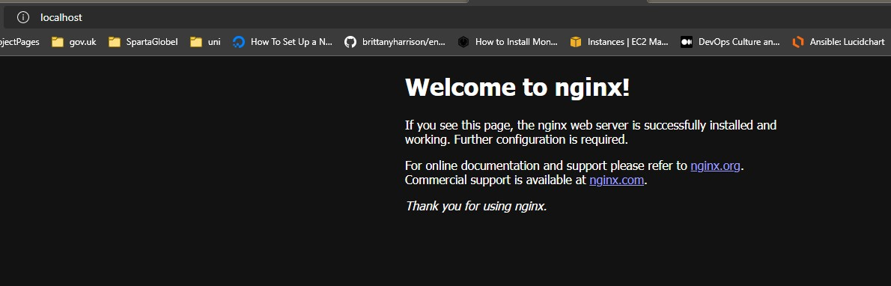

# code along

- 1 - `docker --version`

Docker version 20.10.17, build 100c701

- 2 - `docker`

Gives list of commands

- 3 - `docker pull nginx`

retrieves nginx from docker registry

- 4 `docker run hello-world`

Tests that docker is working correctly

- output - Hello from Docker!

This message shows that your installation appears to be working correctly.

- 5 `docker images`

Lists what has been pulled from registry

- 6 `docker rmi hello-world -f `

Remove image from container

- 7 - `docker run -d -p 80:80 nginx`

run container

-d - dispatch

-p port you want to use

- 8 - `docker ps`
List all docker container

- 9 - `docker container [ps-id] -f`
kills selected container

## result

### When ready to enter container

- go into container
`docker exec -it 5ed2ed6ae921 bash`

- find out what OS were in
`uname` or `uname -a`

- default nginx html
cd usr/share/nginx/html 

- update machine
apt-get update -y

- install nano
apt-get install nano -y

- EDIT html
nano index.html

- docker exit
`docker exit`

- Stop docker running
Docker> docker stop 5ed2ed6ae921  

- Start docker container
docker start 5ed2ed6ae921

- terminate container
`docker rm 5ed2ed6ae921 -f`

- Run docker with debug logs
`docker run -p 80:80 nginx`

- pull and create an image
docker run -d -p 2368:2368 ghost

- github example
docker run -d -p 4000:4000 docs/docker.github.io